<!--
%\VignetteEngine{knitr::rmarkdown}
%\VignetteIndexEntry{Modeling Lake Trophic State: A Data Mining Approach}
-->

#Introduction

Productivity in lentic systems is often categorized across a range of tropic states (e.g. the tropic continuum) from early succesional (i.e. oligotrophic)to late successional lakes (i.e. hypereutrophic) [@carlson1977trophic].  Lakes naturally occur across the range of trophic state and higher primary productivity is not necessarily a predictor of poor ecological condition.  Lakes that are naturally oligotrophic occur in nutrient poor areas or have a more recent geologic history.  These lakes are often found in higher elevations, have clear water, and are often favored for drinking water or direct contact recreation (e.g. swimming).   Lakes with higher productivity (e.g. eutrophic lakes) have greater nutrient loads, tend to be less clear, have greater density of aquatic plants, and often support more diverse and abundant fish communities.  Lakes will naturally shift to higher trophic states but this is a slow process.  Given this fact, monitoring trophic state allows the identification of rapid shifts in trophic state or locating lakes with unusually high productivity (e.g. hypereutrophic).  These cases are indicative of lakes under greater anthropogenic nutrient loads, also known as cultural eutrophication, and are more likely to be at risk of fish kills, fouling, and harmful algal blooms[@smith1998cultural;@smith1999eutrophication;@smith2006eutrophication].  Given the association between trophic state and many ecosystem services and disservices, being able to model trophic state could allow for estimating trophic state in unmonitored lakes and provide a first cut at identifying lakes with the potential for harmful algal blooms and other problems associated with cultural eutrophication.  

Cyanobacteria are an important taxonomic group associated with harmful algal blooms in lakes. Understanding the drivers of cyanobacteria presence has important implications for lake management and for the protection of human and ecosystem health.  Chlorophyll a concentration, a measure of the biological productivity of a lake, is one such driver and is largely, although not exclusively, determined by nutrient inputs.   As nutrient inputs increase, productivity increases and lakes transition from low trophic state (e.g. oligotrophic) to higher trophic states (e.g. hypereutrophic).  These broad trophic state classifications are associated with ecosystem health and ecosystem services/disservices (e.g. recreation, aesthetics, fisheries, and harmful algal blooms).  Thus, models of trophic state might be used to predict things like cyanobacteria.

We have three goals for this preliminary research.  First, we build and assess multiple models of lake trophic state using a full suite of data including *in situ* water quality and universally available data (e.g. landscape data). Second, we assess the accuracy of predicted trophic state in lakes with only the universally available data.  Lastly, we explore associations between trophic state and cyanobacteria to explore.

#Methods

##Data and Study Area
We utilize four primary sources of data for this study,the National Lakes Assessment (NLA), the National Lake Cover Dataset (NLCD), modeled lake morphometery,  and estimated cyanobacteria biovolumes [@usepa2009national;@homer2004development;@xian2009updating;@hollister2010volume;@hollister_predicting_2011;@lakemorpho2014;@beaulieu2013nutrients].  All datasets are national in scale and provide a unique snapshot view of the condition of lakes in the United States'.

The NLA data were collected during the summer of 2007 and the final data were released in 2009.  With consistent methods and metrics collected at 1056 locations across the conterminous United States (Map 1), the NLA provides a unique opportunity to examine broad scale patterns in lake productivity.  The NLA collected data on biophysical measures of lake water quality and habitat.  For this analysis we primarily examined the water quality measurements from the NLA [@usepa2009national].  Adding to the monitoring data collected via the NLA, we use the 2006 NLCD data to examine the possible landscape-level drivers of trophic status in lakes.  The NLCD is a nationally collected land use land cover dataset that also provides estimates of impervious surface.  We collected total land use land cover and total percent impervious surface within a 3 kilometer buffer surrounding the lake to examine larger landscape-level effect [@homer2004development;@xian2009updating]. We also used various measures of lake morphometry (i.e. depth, volume, fetch, etc.) as they are important in understanding lake productivity, yet many of these data are difficult to obtain for large numbers of lakes over broad regions.  To add this information we modeled lake morphometry [@hollister2010volume;@hollister_predicting_2011;@lakemorpho2014;@NLMDInPrep]. Lastly, to explore associations between trophic state and cyanobacteria, we used estimates of cyanobacterial biovoulme caluclated by Beaulieu *et al.* [-@beaulieu2013nutrients].  Cyanobacteria biovolumes are a truer measure of cyanobacteria dominance than abundance as there is great variability in the size within and between species.  We have consolidated the taxa level estimates from Beaulieu *et al.* [-@beaulieu2013nutrients] and  summed that information on a per-lake basis.

 
 

**Predicting Trophic State with Random Forests**

Random forest is a machine learning algorithm that aggregates numerous decision trees in order to obtain a consensus prediction of the response categories [@breiman2001random].  Bootstrapped sample data is recursively partitioned according to a given random subset of predictor variables and completely grown without pruning.   With each new tree, both the sample data and predictor variable subset is randomly selected.  

While random forests are able to handle numerous correlated variables without a decrease in prediction accuracy, unusually large numbers of related variables can reduce accuracy and increase the chances of over-fitting the model.  This is a problem often faced in gene selection and in that field, a variable selection method based on random forest has been succesfully applied [@diaz2006gene].  We use varselRF in R to initially examine the importance of the water quality and GIS derived variables and select a subset, the reduced model, to then pass to random forest[@diaz-uriarte2010varSelRF]. 

Using R’s randomForest package, we pass the reduced models selected with varSelRF and calculate confusion matrices, overall accuracy and kappa coeffecient [@liaw2002randomForest]. From the reduced model random forests we collect a consensus prediction and calculate a confusion matrix and summary stats.

**Model Details**

Using a combination of the `varSelRF` and `randomForest` we ran models for six combinations of variables and trophic state classifications.  These combinations included different combinations of the Chlorphyll *a* trophic states (Table 2) along with all variables and the GIS only variables (i.e. no *in situ* infromation).  The six model combinations were:

1. Chlorophyll *a* trophic state - 4 class = All variables (*in situ* water quality, lake morphometry, and landscape)
2. Chlorophyll *a* trophic state - 3 class = All variables (*in situ* water quality, lake morphometry, and landscape)
3. Chlorophyll *a* trophic state - 2 class = All variables (*in situ* water quality, lake morphometry, and landscape)
4. Chlorophyll *a* trophic state - 4 class = All variables (lake morphometry, and landscape)
5. Chlorophyll *a* trophic state - 3 class = All variables (lake morphometry, and landscape)
6. Chlorophyll *a* trophic state - 2 class = All variables (lake morphometry, and landscape)

|Trophic State (4) |Trophic State (3) |Trophic State (2) |Cut-off |
|:-----------------|:-----------------|:-----------------|:-------|
|oligo             |oligo             |oligo/meso        |<= 0.2  |
|meso              |meso/eu           |oligo/meso        |>2-7    |
|eu                |meso/eu           |eu/hyper          |>7-30   |
|hyper             |hyper             |eu/hyper          |>30     |

##Results

###Model 1: 4 Trophic States ~ All Variables

|Variable | Percent|
|:--------|-------:|
|K        |    1.00|
|NPratio  |    1.00|
|NTL      |    1.00|
|PTL      |    1.00|
|TOC      |    1.00|
|TURB     |    1.00|
|WSA_ECO9 |    1.00|
|ORGION   |    0.29|
|DOC      |    0.18|
|DEPTHMAX |    0.03|

|Oligo |Meso |Eu  |Hyper |class.error |
|:-----|:----|:---|:-----|:-----------|
|135   |58   |4   |1     |0.32        |
|42    |235  |76  |9     |0.35        |
|2     |70   |217 |47    |0.35        |
|0     |3    |68  |175   |0.29        |
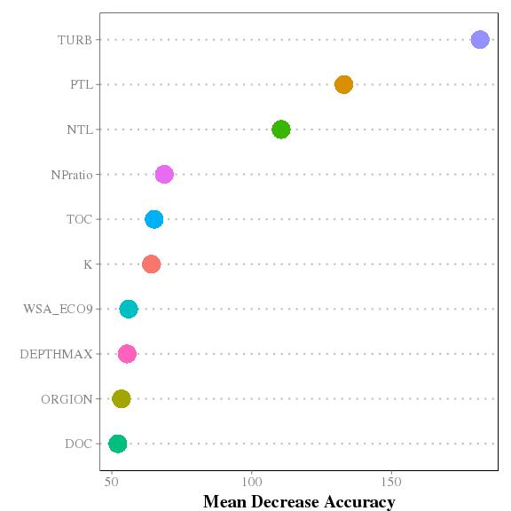  

Total accuracy for Model 1 is 0.667% and the Cohen's Kappa is 0.546.

###Model 2: 3 Trophic States ~ All Variables

|Variable           | Percent|
|:------------------|-------:|
|DOC                |    1.00|
|K                  |    1.00|
|NTL                |    1.00|
|ORGION             |    1.00|
|PTL                |    1.00|
|TOC                |    1.00|
|TURB               |    1.00|
|WSA_ECO9           |    1.00|
|DEPTHMAX           |    0.98|
|NPratio            |    0.76|
|AlbersX            |    0.48|
|CropsPer_3000m     |    0.27|
|ELEV_PT            |    0.16|
|AlbersY            |    0.05|
|NH4                |    0.05|
|PH_FIELD           |    0.01|
|EvergreenPer_3000m |    0.01|

|Oligo |Meso/Eu |Hyper |class.error |
|:-----|:-------|:-----|:-----------|
|121   |75      |0     |0.38        |
|40    |609     |40    |0.12        |
|0     |72      |173   |0.29        |
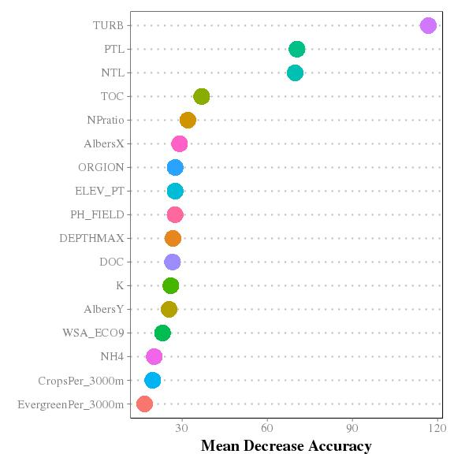 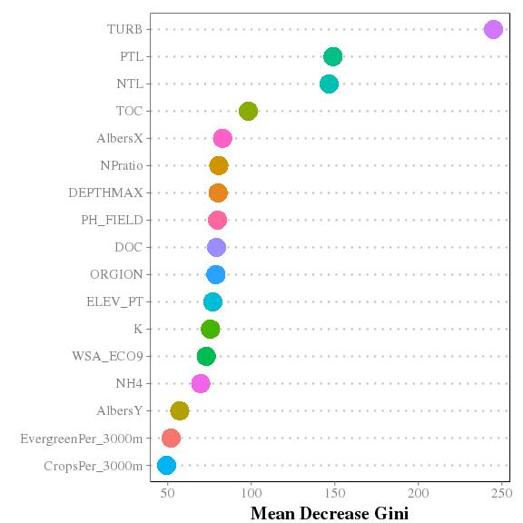 

Total accuracy for Model 2 is 0.799% and the Cohen's Kappa is 0.618.

###Model 3: 2 Trophic States ~ All Variables

|Variable | Percent|
|:--------|-------:|
|K        |    1.00|
|NPratio  |    1.00|
|NTL      |    1.00|
|PTL      |    1.00|
|TOC      |    1.00|
|TURB     |    1.00|
|WSA_ECO9 |    1.00|
|ORGION   |    0.99|
|DEPTHMAX |    0.96|
|DDs45    |    0.90|
|ELEV_PT  |    0.85|
|DOC      |    0.58|
|AlbersX  |    0.06|
|AlbersY  |    0.03|
|Na       |    0.03|

|Oligo/Meso |Eu/Hyper |class.error |
|:----------|:--------|:-----------|
|489        |71       |0.13        |
|77         |505      |0.13        |
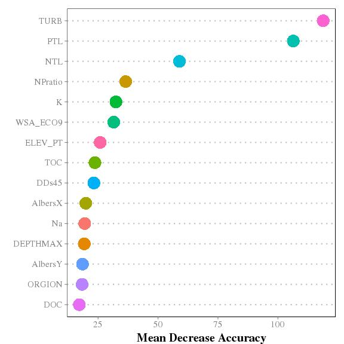 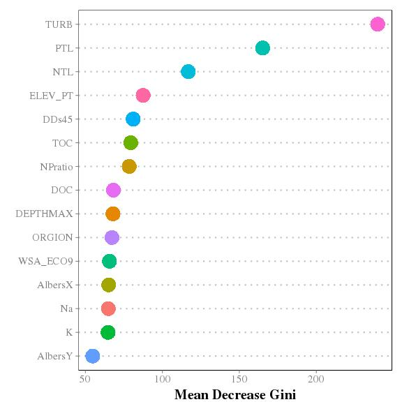 

Total accuracy for Model 3 is 0.87% and the Cohen's Kappa is 0.741.

###Model 4: 4 Trophic States ~ GIS Only Variables

|Variable           | Percent|
|:------------------|-------:|
|AlbersX            |    1.00|
|CropsPer_3000m     |    1.00|
|EvergreenPer_3000m |    1.00|
|MeanDepthCorrect   |    1.00|
|WSA_ECO9           |    1.00|
|AlbersY            |    0.35|
|ELEV_PT            |    0.02|

|Oligo |Meso |Eu  |Hyper |class.error |
|:-----|:----|:---|:-----|:-----------|
|95    |73   |27  |2     |0.52        |
|48    |201  |80  |32    |0.44        |
|20    |114  |124 |77    |0.63        |
|2     |36   |79  |129   |0.48        |
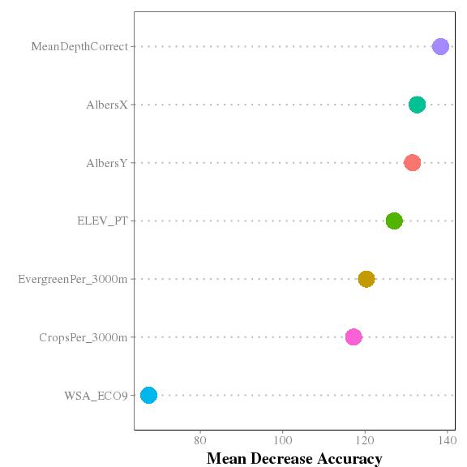 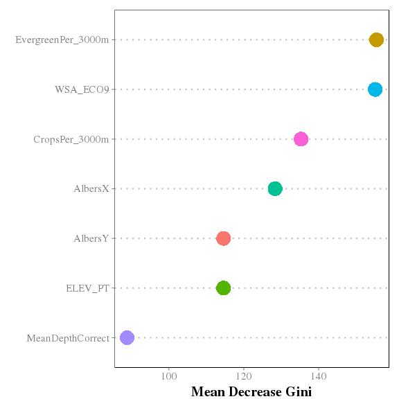 

Total accuracy for Model 4 is 0.482% and the Cohen's Kappa is 0.292.

###Model 5: 3 Trophic States ~ GIS Only Variables

|Variable           | Percent|
|:------------------|-------:|
|AlbersX            |    1.00|
|AlbersY            |    1.00|
|CropsPer_3000m     |    1.00|
|EvergreenPer_3000m |    1.00|
|MaxDepthCorrect    |    1.00|
|MeanDepthCorrect   |    1.00|
|WSA_ECO9           |    1.00|
|ELEV_PT            |    0.97|
|DeciduousPer_3000m |    0.94|
|ShrubPer_3000m     |    0.21|
|WoodyWetPer_3000m  |    0.11|
|DevOpenPer_3000m   |    0.10|
|VolumeCorrect      |    0.04|

|Oligo |Meso/Eu |Hyper |class.error |
|:-----|:-------|:-----|:-----------|
|79    |116     |1     |0.6         |
|48    |582     |66    |0.16        |
|0     |141     |105   |0.57        |
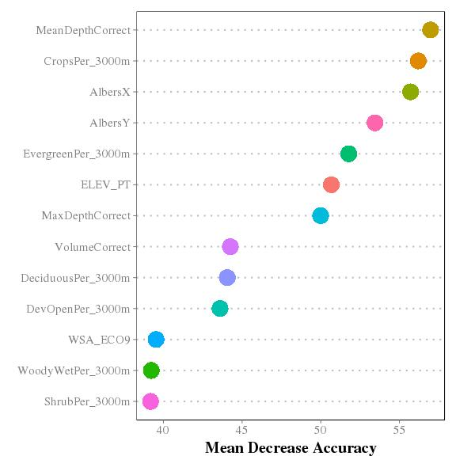 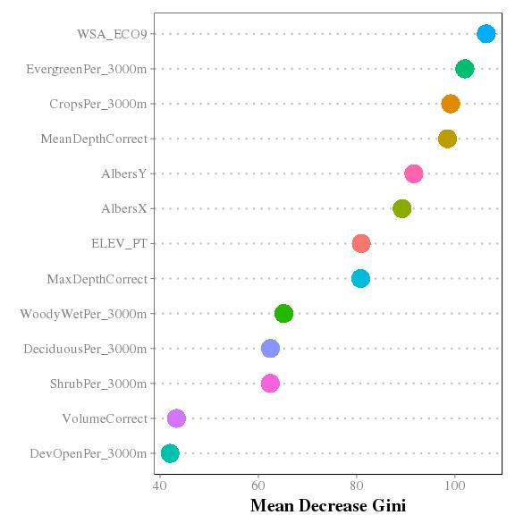 

Total accuracy for Model 5 is 0.673% and the Cohen's Kappa is 0.343.

###Model 6: 2 Trophic States ~ GIS Only Variables

|Variable            | Percent|
|:-------------------|-------:|
|AlbersX             |    1.00|
|CropsPer_3000m      |    1.00|
|DDs45               |    1.00|
|ELEV_PT             |    1.00|
|EvergreenPer_3000m  |    1.00|
|MeanDepthCorrect    |    1.00|
|WSA_ECO9            |    1.00|
|AlbersY             |    0.98|
|MaxDepthCorrect     |    0.98|
|DeciduousPer_3000m  |    0.92|
|DevOpenPer_3000m    |    0.67|
|BASINAREA           |    0.31|
|PercentImperv_3000m |    0.01|

|Oligo/Meso |Eu/Hyper |class.error |
|:----------|:--------|:-----------|
|428        |129      |0.23        |
|146        |435      |0.25        |
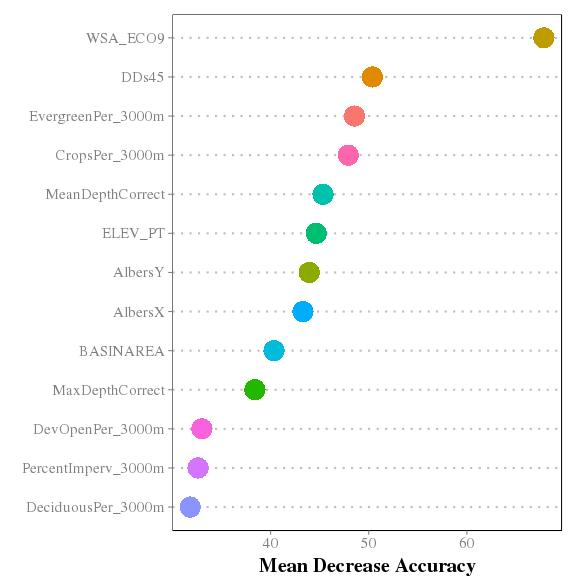 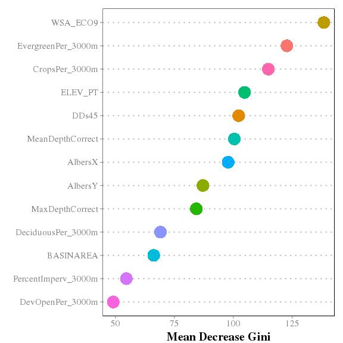 

Total accuracy for Model 6 0.758% and the Cohen's Kappa is 0.517.

###Associating Trophic State and Cyanobacteria

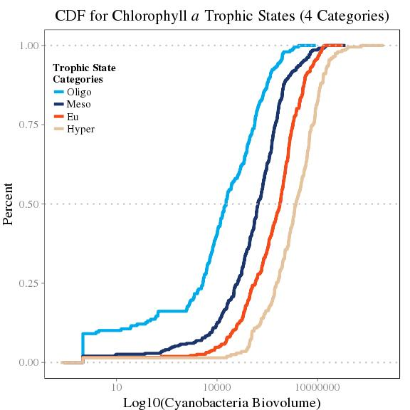 

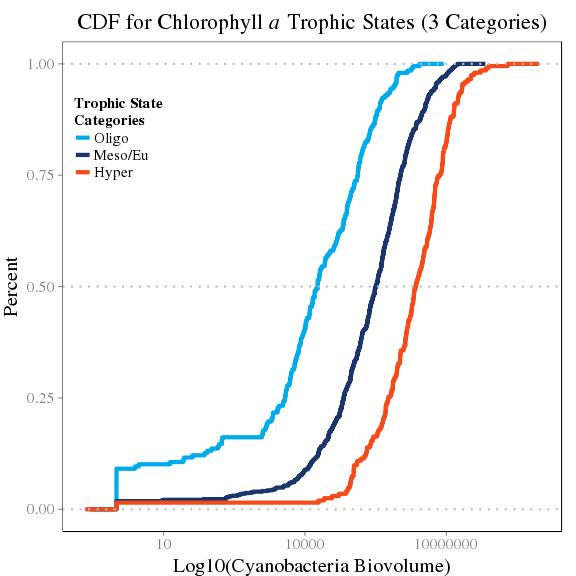 

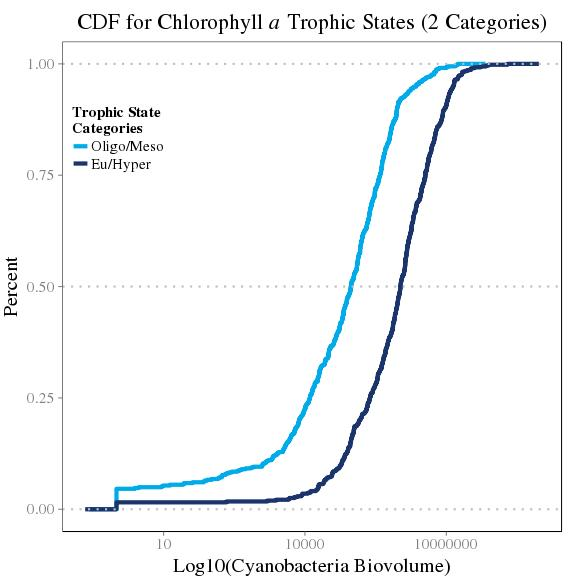 

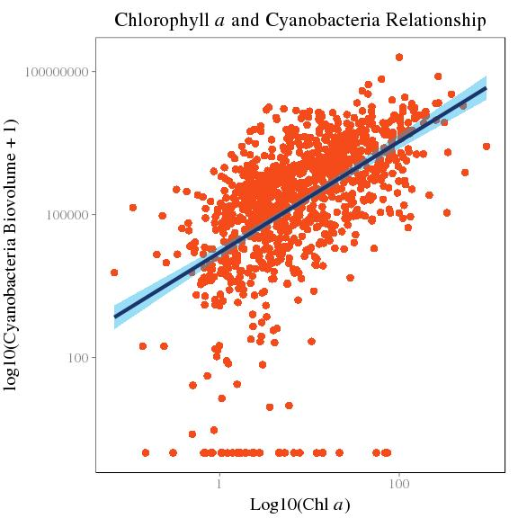 

#References
