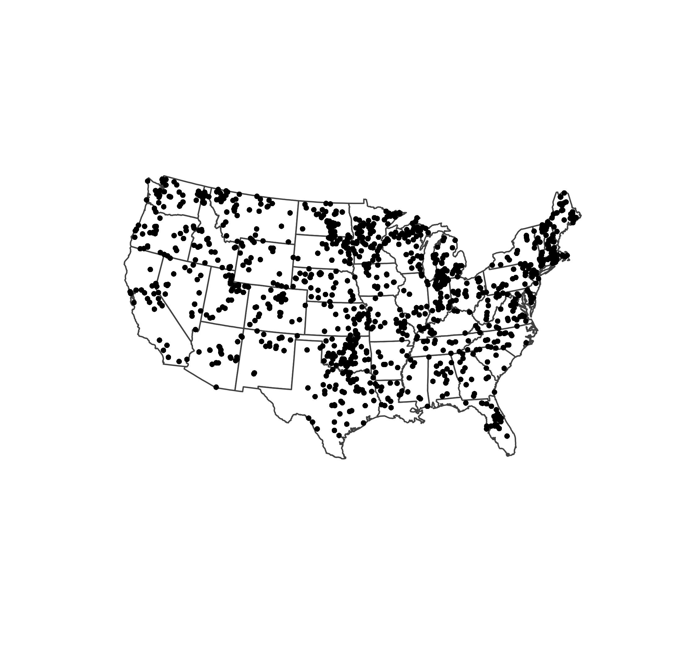
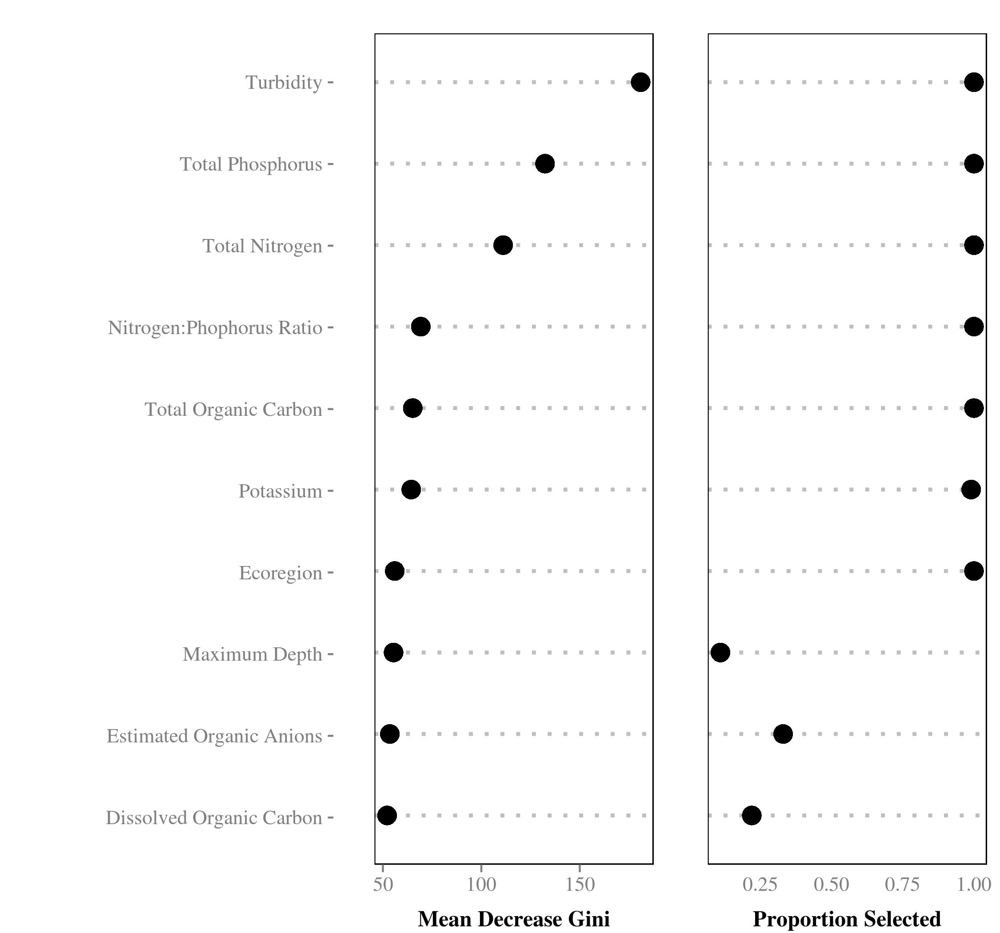
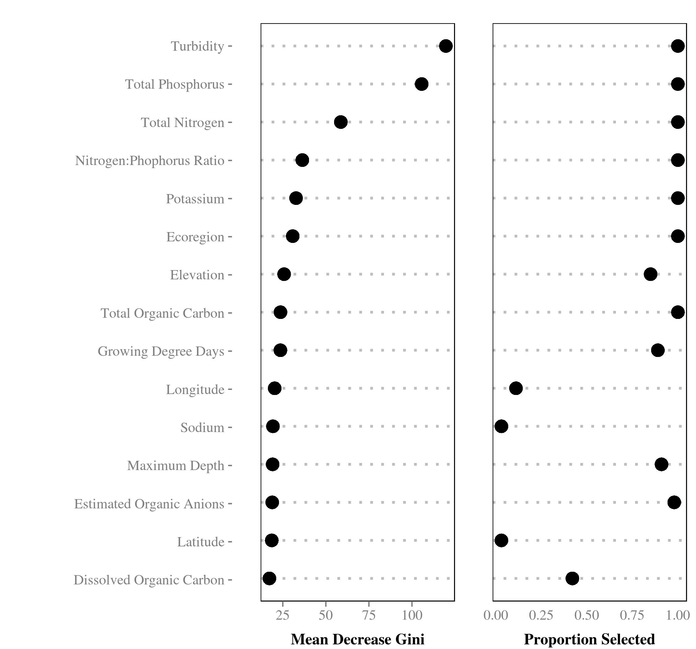
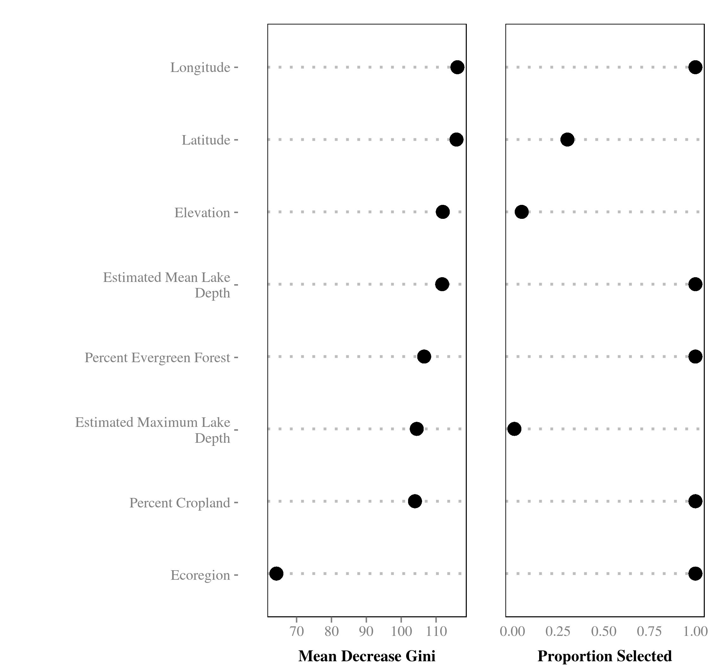
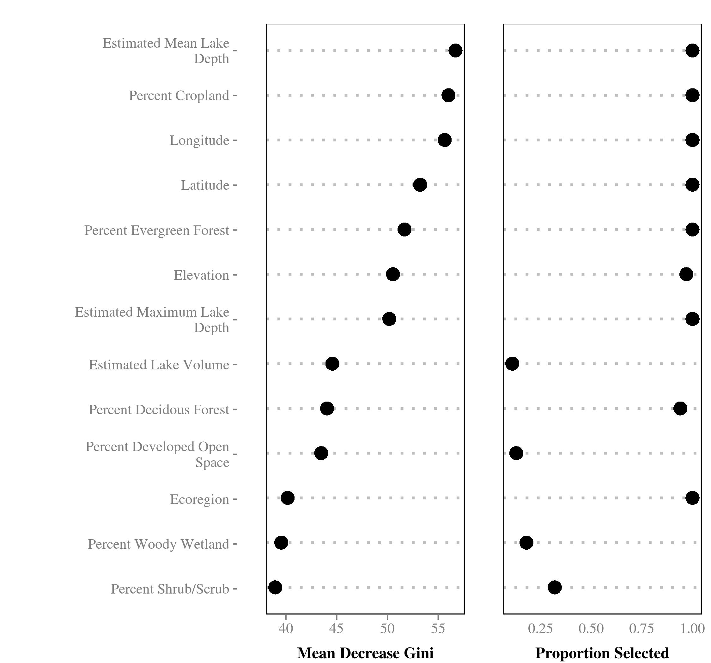
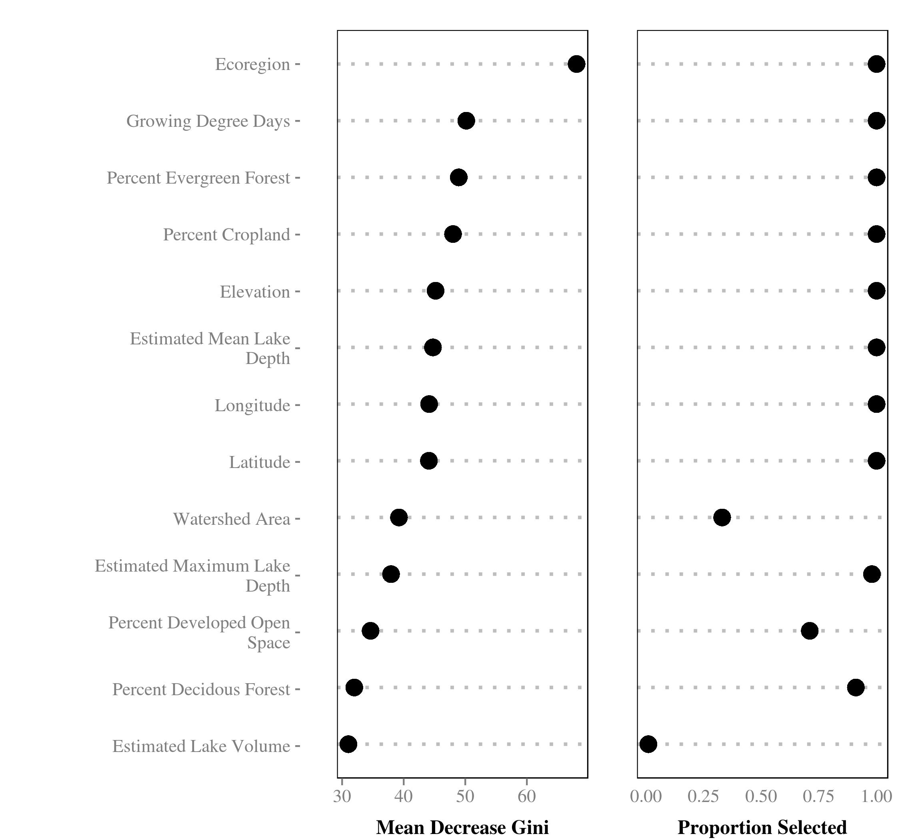
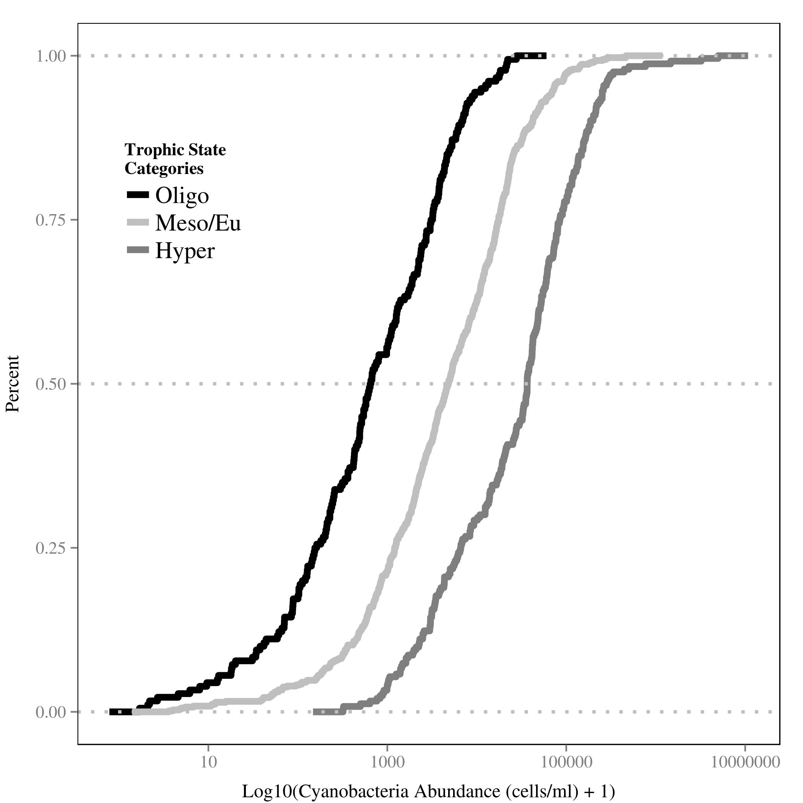
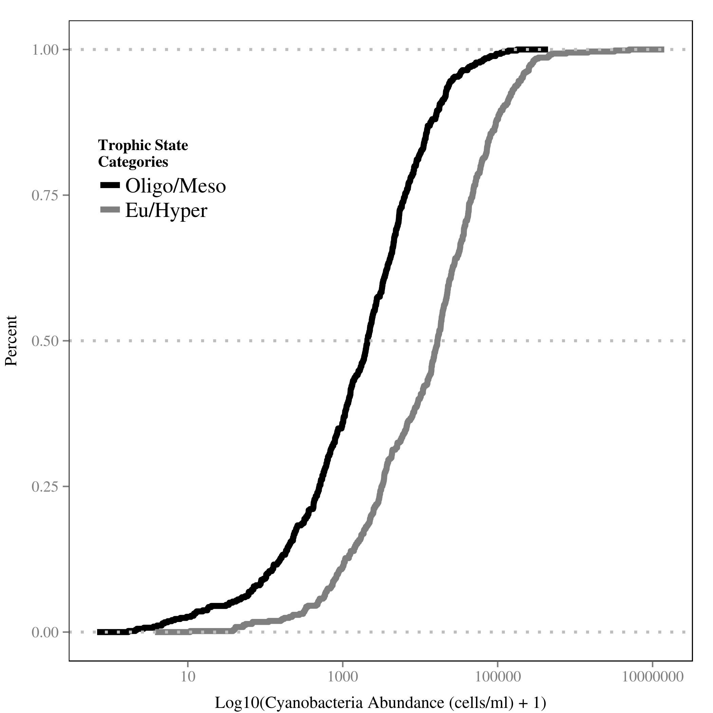
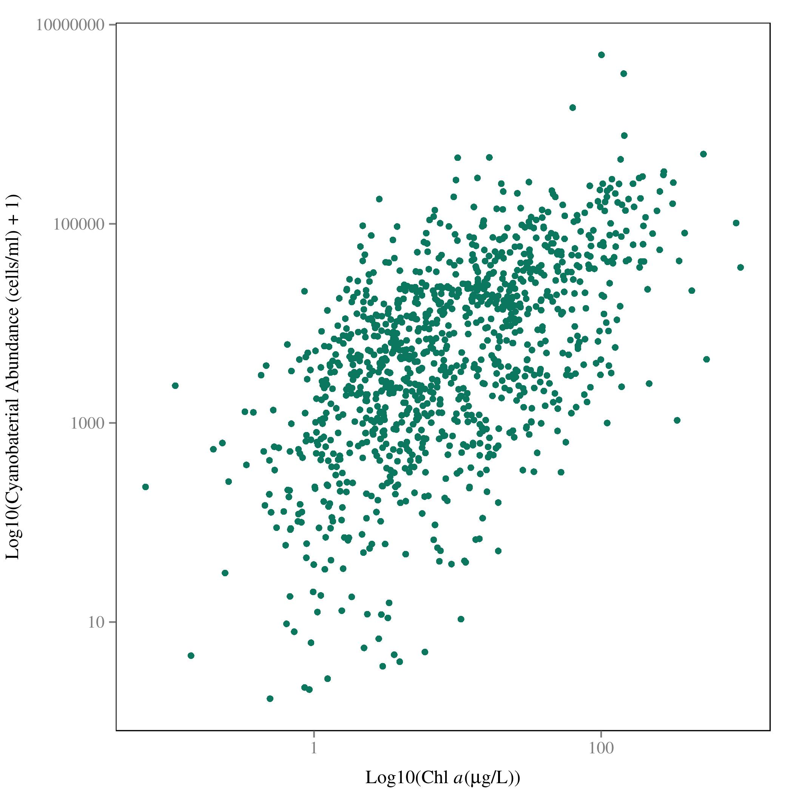

<!--
%\VignetteEngine{knitr::rmarkdown}
%\VignetteIndexEntry{Modeling Lake Trophic State: A Data Mining Approach}
-->

\singlespace

\vspace{2mm}\hrule

**Abstract**  
Productivity of lentic ecosystems has been well studied and it is widely accepted that as nutrient inputs increase,  productivity increases and lakes transition from lower trophic state (e.g. oligotrophic) to higher trophic states  (e.g. eutrophic). These broad trophic state classifications are good predictors of ecosystem condition and ecosystem services and disservices (e.g. recreation, aesthetics, fisheries, and harmful algal blooms). While the relationship between  nutrients and trophic state provides reliable predictions, it requires *in situ* water quality data in order to parameterize the model.  This limits the application of these models to lakes with existing and, more importantly, available water quality data.  To expand our ability to predict trophic state in lakes without water quality data, we take advantage of the availability of a large national lakes water quality database (i.e. the National Lakes Assessment), land use/land cover data, lake morphometry data, other universally available data, and modern data mining approaches to build and assess models of lake trophic state that may be more universally applied.  We use random forests and random forest variable selection to identify variables to be used for predicting trophic state and we compare the performance of two sets of models of trophic state (as determined by chlorophyll *a* concentration).   The first set of models estimates three different trophic state classification with *in situ* as well as universally available data and the second set of models uses universally available GIS data only. Overall accuracy for models built from *in situ* and universal data ranged from 67% to 87%.  For the universal data only models, overall accuracy ranged from 49% to 76%. Lastly, presence and abundance of cyanobacteria is often strongly associated with trophic state.  To test this we examine the association between estimates of cyanobacteria abundance and measured chlorophyll *a* and find a positive relationship.  These results suggest that predictive models of lake trophic state may be improved with additional information on the landscape surrounding lakes and that those models provide additional information on the presence of potentially harmful cyanobacteria taxa. Lastly, the source code and data for this manuscript are freely available from https://github.com/USEPA/LakeTrophicModelling.

\vspace{3mm}\hrule
\doublespace

#Introduction
Productivity in lentic systems is often categorized across a range of trophic states (e.g. the trophic continuum) from early successional (i.e. oligotrophic) to late successional lakes (i.e. hypereutrophic) with lakes naturally occurring across this range [@carlson1977trophic]. Oligotrophic lakes occur in nutrient poor areas or have a more recent geologic history, are often found in higher elevations, have clear water, and are usually favored for drinking water or direct contact recreation (e.g. swimming).   Lakes with higher productivity (e.g. mesotrophic and eutrophic lakes) have greater nutrient loads, tend to be less clear, have greater density of aquatic plants, and often support more diverse and abundant fish communities. Higher primary productivity is not necessarily a predictor of poor ecological condition as it is natural for lakes to shift from lower to higher trophic states but this is a slow process. However, at the highest productivity levels (hypereutrophic lakes) biological integrity is compromised [@hasler1969cultural; @schindler2008algal; @smith1999eutrophication].  

Monitoring trophic state allows the identification of rapid shifts in trophic state or locating lakes with unusually high productivity (e.g. hypereutrophic).  These cases are indicative of lakes under greater anthropogenic nutrient loads, also known as cultural eutrophication, and are more likely to be at risk of fish kills, fouling, and harmful algal blooms [@smith1998cultural;@smith1999eutrophication;@smith2006eutrophication].  Given the association between trophic state and many ecosystem services and disservices, being able to accurately model trophic state could provide a first cut at identifying lakes with the potential for harmful algal blooms (i.e. from cyanobacteria) or other problems associated with cultural eutrophication.  This type of information could be used for setting priorities for managment and allow for more effecient use of limited resources.

As trophic state and related indices can be best defined by a number of *in situ* water quality parameters (modeled or measured), most models have used this information as predictors [e.g., @carvalho_cyanobacterial_2011;@milstead2013estimating;@imboden1978dynamic;@salas1991simplified].  This leads to accurate models, but also requires data that are often sparse and not always available, thus limiting the population of lakes for which we can make predictions.  A possible solution for this is to build models that use widely available data that are correlated to many of the *in situ* variables. For instance, landscape metrics of forests, agriculture, wetlands, and urban land in contributing watersheds have all been shown to explain a significant proportion of the variation (ranging from 50-86%, depending on study) in nutrients in receiving waters [@jones2001predicting; @jones2004importance; @seilheimer2013landscape].  Building on these previously identified associations might allow us to use only landscape and other universally available data to build models.  Identifying predictors using this type of ubiquitous data would allow for estimating trophic state in both monitored and unmonitored lakes. 

Many published models of nutrients and trophic state in freshwater systems are based on linear modelling methods such as standard least squares regression or linear mixed models [e.g., @jones2004importance; @jones2001predicting].  While these methods have proven to be reliable, they have limitations (e.g. independence and distribution assumptions, and outlier sensitivity).  Using data mining approaches, such as random forests, avoids many of the limitations, may reduce bias and often provides better predictions [@cutler2007random; @peters2007random; @breiman2001random].  For instance, random forests are non-parametric and thus the data do not need to come from a specific distribution (e.g. Gaussian) and can contain collinear variables [@cutler2007random]. Second, random forests work well with very large numbers of predictors [@cutler2007random].  Lastly, random forests can deal with model selection uncertainty as predictions are based upon a consensus of many models and not just a single model selected with some measure of goodness of fit. 

To build on past work, we have identified five areas in which this research contributes.  First, we update trophic state modelling efforts with the use of random forests.  Second, we assess the accuracy of predicted trophic state in lakes with the a) *in situ* and universally available GIS data  and then b) with the universally available GIS data only. Third, we identify important variables for describing lake trophic state.  Fourth, we explore associations between trophic state and cyanobacteria, a key taxa in harmful algal blooms, so that we may begin to understand how changes in trophic state may be linked to an important ecosystem disservice.  Lastly, a key goal of this research is to provide full access to the data and code.  As such, this paper, the code, and the data used in the models is made available as an R package from https://github.com/USEPA/LakeTrophicModeling.  

#Methods

##Data and Study Area
We utilize three primary sources of data for this study, the National Lakes Assessment (NLA), the National Land Cover Dataset (NLCD), and  lake morphometery modeled from the NHDPlus and National Elevation Data Set [@usepa2009national;@homer2004development;@xian2009updating;@hollister2010volume;@hollister_predicting_2011;@lakemorpho2014].  All datasets are national in scale and provide a unique snapshot view of the condition of lakes in the conterminous United States during the summer of 2007.

The NLA data were collected during the summer of 2007 and the final data were released in 2009 [@usepa2009national].  With consistent methods and metrics collected at 1056 locations across the conterminous United States (Figure \ref{fig:nlaMap}), the NLA provides a unique opportunity to examine broad scale patterns in lake productivity.  The NLA collected data on biophysical measures of lake water quality and habitat as well as an assessment of the phytoplankton community.  For this analysis we examined the water quality measurements and total cyanobacteria abundance from the National Lakes Assessment [@usepa2009national].   

Adding to the monitoring data collected via the NLA, we use the 2006 NLCD data to examine landscape-level drivers of trophic status in lakes.  The NLCD is a national land use/land cover dataset that also provides estimates of impervious surface.  We calculated total proportion of each NLCD land use land cover class and total percent impervious surface within a 3 kilometer buffer surrounding each lake [@homer2004development;@xian2009updating].  A three kilometer buffer was selected as an intermediate measure of the adjacent neighborhood; the three kilometer buffer size is greater than the immediate parcel but smaller than regional  and whole-basin measures.  

To account for unique aspects of each lake and characterize lake productivity, we also used measures of lake morphometry (i.e. depth, volume, fetch, etc.).  As these data are difficult to obtain for large numbers of lakes over broad regions, we used modeled estimates of lake morphometry [@hollister2010volume;@hollister_predicting_2011;@lakemorpho2014]. These included: surface area, shoreline length, Shoreline Development, Maximum Depth, Mean Depth, Lake Volume, Maximum Lake Length, Mean Lake Width, Maximum Lake Width, and Fetch.  

##Predicting Trophic State with Random Forests
Random forest is a machine learning algorithm that aggregates numerous decision trees in order to obtain a consensus prediction of the response categories [@breiman2001random].  Bootstrapped sample data are recursively partitioned according to a given random subset of predictor variables and a predetermined number of decision trees  are developed.   With each new tree, the sample data subset is randomly selected and with each new split, the subset of predictor variables are randomly selected.  A detailed discussion of the benefits of a random forest approach is beyond the scope of this paper.  To find out more see Breiman [-@breiman2001random] and Cutler et al. [-@cutler2007random].

Random forests are able to handle numerous correlated variables without a decrease in prediction accuracy; however, one possible downfall to this approach is that the resulting model may be difficult to interpret.  This is a problem often faced in gene selection and in that field, a variable selection method based on random forest has been successfully applied and implemented in the R Language as the `varSelRF` package [@diaz2006gene].  With this method, a minimum set of variables that maximizes model accuracy is provided.  This allows us to start with a full suite of predictor variables from which to select a minimum, easier to interpret set of variables.  One issue with the approach in `varSelRF` is that because of the randomization inherent in random forests it is possible to get variation in the minimum selected set of variables.  To account for this we repeated `varSelRF` 100 times.  In our case, repeating the procedure 100 times quickly converged on a set of all possible important variables.  

##Model Details
Using both the `varSelRF` and `randomForest` R packages we ran models for six sets of variables and trophic state classifications [@diaz-uriarte2010varSelRF; @liaw2002randomForest].  These included three different combinations of the chlorophyll *a* trophic states as the dependent variables and using all variables (*in situ* and GIS variables) or the GIS only variables (i.e. no *in situ* information) as the independent variables in the random forest.  A listing of all considered variables is in Appendix 1.  Trophic state was defined using the NLA chlorophyll *a* trophic state cut offs and the three combinations of trophic state were used to highlight the possible error caused by misclassification of adjacent classes, such as mesotrophic and eutrophic (Table \ref{tab:trophicStateTable}). Our separation of predictors was chosen so that we could highlight the additional predictive performance provided by adding the *in situ* water quality variables on top of the GIS only variables.  Lastly, we used only complete cases (i.e. missing data were removed) so the total number of observations varied between models. 

The six model combinations were:

- **Model 1:** Chlorophyll *a* trophic state (4 class) = All variables (*in situ* water quality, lake morphometry, and landscape)
- **Model 2:** Chlorophyll *a* trophic state (3 class) = All variables (*in situ* water quality, lake morphometry, and landscape)
- **Model 3:** Chlorophyll *a* trophic state (2 class) = All variables (*in situ* water quality, lake morphometry, and landscape)
- **Model 4:** Chlorophyll *a* trophic state (4 class) = GIS Only variables (lake morphometry, and landscape)
- **Model 5:** Chlorophyll *a* trophic state (3 class) = GIS Only variables (lake morphometry, and landscape)
- **Model 6:** Chlorophyll *a* trophic state (2 class) = GIS Only variables (lake morphometry, and landscape)

Our modelling work flow was as follows:

1. Use `iterVarSelRF` in the `LakeTrophicModelling` R package to identify a minimal set of variables that maximize accuracy of the random forest algorithm [@diaz-uriarte2010varSelRF; @LakeTrophicModelling]. This subset of variables, the reduced model, is calculated for each of our 6 models. 
2. Using R's `randomForest` package, we pass the reduced models selected with `iterVarSelRF` and assess model performance [@liaw2002randomForest]. 

##Measures of Model Performance and Variable Importance

We assessed the performance of the random forest models by comparing the total prediction accuracy and the kappa coefficient of the final confusion matrix. For each of the models, the final predictions were compared to the original data via a confusion matrix. A confusion matrix shows agreement and disagreement with predicted values forming the columns of the matrix and observed values, the rows. The total accuracy (i.e. percent correctly predicted) was calculated.  Since some agreement can be expected by chance alone, it is also useful to take this type of error into account.  For this we calculated the kappa coefficient from the confusion matrix for each model as well [@cohen1960coefficient; @hubert1985comparing].   The kappa coefficient can range from -1 to 1 with 0 equalling the agreement expected by chance alone.  Values greater than 0 represent agreement greater than would be expected by chance, with values greater than 0.61 considered "substantial" agreement  [@landis1977measurement].  Negative values are rare and would indicate no agreement between the predicted and observed values. Additonally, random forest builds each tree on bootstrapped, random subsets of the original data, thus, a separate independent validation dataset is not required and random forest error estimates are expected to be unbiased [@breiman2001random]. 

Lastly, the random forest algorithm explicitly measures variable importance as mean decrease in Gini.  The Gini Index is a measure of how well the data are classified into homogeneous groups.  For every node, the splitting variables are permuted and the change in actual Gini and permuted Gini is recorded.  The mean decrease Gini is a summed and standardized value for each variable [@breiman2001random].  Higher values of mean decrease Gini suggest a higher importance for that variable.

#Results 

Our complete dataset includes 1148 lakes; however 5 lakes did not have chlorophyll *a* data. Thus, the base dataset for our modelling was conducted on data for 1143 lakes.  As chlorophyll *a* is used to create the trophic state classifications, it was necessary to remove these data because no chlorophyll *a* trophic state could be determined for these lakes.  The lakes were well distributed both across the four trophic state categories (Table \ref{tab:trophicStateTable}) and spatially throughout the United States (Figure \ref{fig:nlaMap}).  

##Models
Accuracy for the models built with all predictors ranged from 67% to 87% and the kappa coefficient had a minimum value of 0.55 and maximum of 0.73.  The GIS only models had a total accuracy between 49% and 76% and kappa coefficient between 0.3 and 0.52.  The importance of variables for the models including the *in situ* data were fairly stable while there was considerably more variation in variable importance for the three different GIS only models.  Additionally, as each model contained a different subset of variables and since we removed observations with missing data, the total number of lakes varied across the models.  Details for each model are discussed below.

*Model 1: 4 Trophic States ~ All Variables*

Total number of lakes for Model 1 was 1142 and the reduced model for Model 1 included turbidity, total phosphorus, total nitrogen, nitrogen:phosphorus ratio, total organic carbon, potassium, ecoregion, maximum depth, organic ions, and dissolved organic carbon. Of these, turbidity, total phosphorus, and total nitrogen were the three most important predictors of the four classes of trophic state (Figure \ref{fig:Importance_Model1}). Total accuracy for Model 1 was 67% and the Cohen's Kappa was 0.55 (Table \ref{tab:Confusion_Model1}).  

*Model 2: 3 Trophic States ~ All Variables*

For Model 2 there were 1130 observations and the reduced model included turbidity, total phosphorus, total nitrogen, total organic carbon, nitrogen:phosphorus, longitude, pH, estimated organic anions, elevation, maximum depth, dissolved organic carbon, potassium, latitude, ecoregion, chloride, ammonium and percent cropland (Figure \ref{fig:Importance_Model2}). The top predictors for 3 trophic state classes were again turbidity, total phosphorus, and total nitrogen (Figure \ref{fig:Importance_Model2}).  Model 2 accuracy was 80% and the Cohen's Kappa was 0.61 (Table \ref{tab:Confusion_Model2}).   

*Model 3: 2 Trophic States ~ All Variables*

Model 3 was built with 1142 lakes and the reduced model was similar to Model 1 and Model 2.  This model included turbidity, total phosphorus, total nitrogen, nitrogen:phosphorus, potassium, ecoregion, elevation, total organic carbon, growing degree days, longitude, sodium, maximum depth, estimated organic anions, latitude, and dissolved organic carbon (Figure \ref{fig:Importance_Model3}). The top three predictors were the same as Models 1 and 2. (Figure \ref{fig:Importance_Model3}).  Total accuracy for Model 3 was 87% and the Cohen's Kappa was 0.73 (Table \ref{tab:Confusion_Model3}).

*Model 4: 4 Trophic States ~ GIS Only Variables*

Model 4 had a sample size of 1138. The selected variables for the Model 4 were longitude, latitude, elevation, estimated mean lake depth, percent evergreen forest, estimated maximum lake depth, percent cropland, and ecoregion (Figure \ref{fig:Importance_Model4}).  The three most important variables were longitude, latitude, and elevation (Figure \ref{fig:Importance_Model4}); however, all variables except ecoregion were almost equally important. Total accuracy for Model 4 was 49% and the Cohen's Kappa was 0.3 (Table \ref{tab:Confusion_Model4}).

*Model 5: 3 Trophic States ~ GIS Only Variables*

A total of 1138 lakes were used for model 5 which included estimated mean lake depth, percent cropland, longitude, latitude, percent evergreen forest, elevation, estimated maximum lake depth, estimated lake volume, percent deciduous forest, percent developed open space, ecoregion, percent woody wetland, and percent shrub/scrub (Figure \ref{fig:Importance_Model5}). The most important variables for model 5 were estimated mean lake depth, percent cropland, and longitude. (Figure \ref{fig:Importance_Model5}). Total accuracy for Model 5 was 68% and the Cohen's Kappa was 0.35 (Table \ref{tab:Confusion_Model5}).

*Model 6: 2 Trophic States ~ GIS Only Variables*

Model 6 was built using  1138 total observations. The variable selection process for Model 6 produced a reduced model with ecoregion, growing degree days, percent evergreen forest, percent cropland, elevation, estimated mean lake depth, longitude, latitude, watershed area, estimated maximum lake depth, percent developed open space, percent deciduous forest, and estimated lake volume (Figure \ref{fig:Importance_Model6}).  The three most important variables were ecoregion, growing degree days, and percent evergreen. (Figure \ref{fig:Importance_Model6}).  Ecoregion had the highest importance with a slow decline in importance for the remainder of the variables.  Total accuracy for Model 6 was 76% and the Cohen's Kappa was 0.52 (Table \ref{tab:Confusion_Model6}).

#Discussion

##Trophic State Probabilities
One of the powerful features of random forests is the ability to aggregate a very large number of competing models or trees.  Each tree provides an independent prediction or vote for a possible outcome.  In the context of our trophic state models, we have 10,000 votes for each lake.  These values may be interpreted as the probability that a lake is in a given trophic state. For instance, for a single lake (National Lake Assessment ID = NLA06608-0005), the vote probabilities for Model 1 were 81% for oligotrophic, 19% for mesotrophic, 0% for eutrophic, and 0% for hypereutrophic.  This suggests little uncertainty in the predicted oligotrophic state.  

Further, the maximum probability for each lake can be used as a measure of how certain the random forest model was of the prediction.  We would expect higher total accuracy for lakes that had more certain predictions.  Some lakes may have many votes for a single trophic state and few votes for other trophic states and these would thus have a large maximum probability and the random forest predicitions would be more certain.  Alternatively, the 10,000 votes could have been spread more equally across the trophic state classes for a lake and that lake would have a small maximum probability and the final predictions would be less certain.  This should be evident by looking at the total classification accuracy of lakes given their maximum probability is above a certain point.  To test this we can examine the accuracy of trophic state predictions across the full range of trophic state probabilities, similar to an approach outlined by Paul and MacDonald [-@paul2005development] and implemented by Hollister et al. [-@hollister2008cprob].  We utilize this approach and examine the change in total accuracy as a function of the maximum probability for each lake.  As expected, lakes with higher maximum vote probabilities were more accurately predicted (Figure \ref{fig:condProbFig}).  The increasing trend suggests that even for models with lower overall accuracy there can also be a large number of individual cases that are predicted with high accuracy.

##Variable Selection and Importance
There was a great deal of agreement on the important variables for each set of models.  In line with past predictive modeling of cyanobacteria abundance and not surprisingly, the *in situ* models consistently select the water quality variables (turbidity, total nitrogen, total phosphorus, and N:P ratios) as important variables [@downing2001predicting].   While there is variation in the response of cyanobacteria to changes in relative nutrient concentrations, the general pattern suggests that limiting nutrients have considerable impact once amounts increase beyond expected levels.  

The mechanistic role of turbidity on lake trophic state is more complex.  Light availability in turbid waters is lower than in clear waters.  This would suggest a negative relationship between turbidity and chlorophyll *a*.  Second, chlorophyll *a* can also be a component of turbidity and lakes with higher chlorophyll *a* concentrations will also be more turbid.  Last, chlorophyll *a* is not the only component of of turbidity and turbid waters can be caused by, for example, increased sediment loads or tannin.  This would be a cause for concern with linear models; however, linearity is not an assumption of tree-based modelling approaches such as random forest. 

Our models with the GIS-only variables captured the large scale spatial pattern of the trophic status gradient of lakes across the United States.  We reliably saw latitude and longitude and ecoregion selected as important variables.  It is also possible that other variables selected as important are also capturing a portion of this trend. For instance, elevation and growing degree days both have obvious spatial components, but may also be accounting for variation in temperature.  

The land use/land cover variables were also important in describing trophic state patterns.  Like elevation and growing degree days, broad scale spatial patterns are inherent in the data.  For instance, the relative continental position of mountains in the United States is the spatial inverse of the distribution of agricultural lands. However, it is known that forests are positively associated with lower nutrient loads where as agricultural land shows a negative association.  These more local scale relationships with land use/land cover  likely provide additional predictive power to the information in the broader scale data. 

Lastly, morphometry (e.g. depth and volume) also proved to be important in the prediction of lake trophic state.  As morphometry shows little to no broad scale spatial pattern and is unique to a given lake, these data are likely illuminating the local, lake scale drivers of trophic state.  As only depth and volume were selected, this likely shows the importance of in-lake nutrient processing and residence time.

##Associating Trophic State and Cyanobacteria

Cyanobacteria biomass should be closely associated with trophic state as cyanobacteria contribute to the chlorophyll concentration in a lake. If these associations are strong enough we may be able to expand models such as those reported here to also predict probability of cyanobacteria blooms.  To test if trophic state can be used to differentiate cyanobacteria abundance, we examine distribution of cyanobacteria abundance for each trophic state and also explored linear associations between chlorohyll *a* and cyanobacteria abundance.

The distribution of cyanobacteria abundance showed separation between all of the trophic state classifications (Figures \ref{fig:ts_4_cyano_cdf}, \ref{fig:ts_3_cyano_cdf}, and \ref{fig:ts_2_cyano_cdf}) and there was a significant linear relationship (r^2^=0.33) between chlorophyll *a* and cyanobacteria abundance (Figure \ref{fig:scatterplot}).  Furthermore, Yuan et al. [-@yuan2014managing] used the 2007 NLA to demonstrate that total nitrogen and chlorophyll *a* concentrations were good predictors of World Health Organization microcystin (a toxin produced by some cyanobacteria) criteria exceedences.  These results suggest that trophic state is indeed an acceptable proxy for cyanobacteria abundance and that in lakes with higher trophic state it is also reasonable to expect higher cyanobacteria.  

#Conclusions

Our research goals were to explore the utility of a widely used data mining algorithm, random forests, in the modelling of lake trophic state. Further, we hoped to examine the utility of these models when built with only ubiquitous GIS data, which allows estimation of trophic state for all lakes in the United States. We were able to successfully predict a variety of trophic state classes.  With the GIS only models our total accuracy ranged from 49% to 76%, and with the full suite of data our model accuracy had a minimum accuracy of 67% and maximum accuracy of 87%.  

While some of the models (i.e. Model 4) showed relatively low prediction accuracies, another feature of the random forest, votes, can provide additional information.  In addition to providing a single estimate of trophic state for each lake, our models also indicated the probability that a lake was classified in any of the categories.  These probabilities may be mapped directly to show the uncertainty of a given predicted class.  Furthermore, as the certainty of prediction increases, so does overall trophic state classification accuracy (Figure \ref{fig:condProbFig}). These results suggest that our models will provide reasonable estimates of trophic state across the United States.

There was great deal of agreement on the important variables for each set of models.  For the combined *in situ* and GIS models, the *in situ* water quality variables drove the predictions.  This is expected.  For the GIS only models,  the results were more nuanced with three broad categories routinely being selected as important: broad scale spatial patterns in trophic state, land use/land cover controls of trophic state, and local, lake-scale control driven by lake morphometry.  Lastly, associations between trophic state and cyanobacteria showed that, at the broad scale of the 2007 NLA, there is a linear relationship between chlorophyll *a* and cyanobacteria abundance and that using trophic state as a proxy for cyanobacteria has potential. 

These broad categories and the association between trophic state and total cyanobacteria abundance raise three important considerations related to managing eutrophication.  First, the broad scale patterning suggests regional trends.  This is important because it suggests that efforts to monitor, model and manage eutrophication and cyanobacteria should be undertaken at both national and regional levels.  Second, while direct control of water quality in lakes would have a large impact, the land use/land cover drivers (i.e. non-point sources) of water quality are also important, and better management of the spatial distribution of important classes such as forest and agriculture can provide some level of control on trophic state and amount of cyanobacteria present.  Third, in-lake processes (i.e. residence time, nutrient cycling, etc.) are, as expected, very important and need to be part of any management strategy.  Building on these efforts through updated models,  direct prediction of cyanobacteria, and additional information on the regional differences will help us get a better handle on the broad scale dynamics of productivity in lakes and the potential risk to human health from cyanobacteria blooms.

#Acknowledgements
We would like to thank Farnaz Nojavan, Nathan Schmucker, John Kiddon, Joe LiVolsi, Tim Gleason, and Wayne Munns for constructive reviews of this paper.  This paper has not been subjected to Agency review. Therefore, it does not necessary reflect the views of the Agency. Mention of trade names or commercial products does not constitute endorsement or recommendation for use. This contribution is identified by the tracking number ORD-011075 of the Atlantic Ecology Division, Office of Research and Development, National Health and Environmental Effects Research Laboratory, US Environmental Protection Agency.

\newpage

#Figures

 

\newpage

 

\newpage

 

\newpage

 

\newpage

 

\newpage

 

\newpage

 

\newpage

 

\newpage

 

\newpage

 

\newpage

 

\newpage

 

\newpage

#Tables

|Trophic State (4 class) |Trophic State (3 class) |Trophic State (2 class)  |Concentration Cut-off |
|:-----------------------|:-----------------------|:------------------------|:---------------------|
|oligotrophic            |oligotrophic            |oligotrophic/mesotrophic |<= 0.2                |
|mesotrophic             |mesotrophic/eutrophic   |oligotrophic/mesotrophic |>2-7                  |
|eutrophic               |mesotrophic/eutrophic   |eutrophic/hypereutrophic |>7-30                 |
|hypereutrophic          |hypereutrophic          |eutrophic/hypereutrophic |>30                   |

:Chlorophyll a based trophic state cut-offs with total number of possible observations.\label{tab:trophicStateTable}

\newpage

|      |Oligo |Meso |Eu  |Hyper |Class Accuracy |
|:-----|:-----|:----|:---|:-----|:--------------|
|Oligo |135   |58   |4   |1     |68%            |
|Meso  |42    |233  |77  |10    |64%            |
|Eu    |2     |66   |222 |46    |66%            |
|Hyper |0     |3    |69  |174   |71%            |

:Random Forest confusion matrix for Model 1. Columns show predicted values and rows show observed values.  Agreement indicated on diagonal and accuracy for each trophic state indicated in 'Class Accuracy' column. \label{tab:Confusion_Model1}

\newpage

|        |Oligo |Meso/Eu |Hyper |Class Accuracy |
|:-------|:-----|:-------|:-----|:--------------|
|Oligo   |122   |74      |0     |62%            |
|Meso/Eu |43    |604     |42    |88%            |
|Hyper   |0     |72      |173   |71%            |

:Random Forest confusion matrix for Model 2. Columns show predicted values and rows show observed values.  Agreement indicated on diagonal and accuracy for each trophic state indicated in 'Class Accuracy' column.  \label{tab:Confusion_Model2}

\newpage

|           |Oligo/Meso |Eu/Hyper |Class Accuracy |
|:----------|:----------|:--------|:--------------|
|Oligo/Meso |485        |75       |87%            |
|Eu/Hyper   |77         |505      |87%            |

:Random Forest confusion matrix for Model 3. Columns show predicted values and rows show observed values.  Agreement indicated on diagonal and accuracy for each trophic state indicated in 'Class Accuracy' column. \label{tab:Confusion_Model3}

\newpage

|      |Oligo |Meso |Eu  |Hyper |Class Accuracy |
|:-----|:-----|:----|:---|:-----|:--------------|
|Oligo |94    |72   |28  |2     |48%            |
|Meso  |50    |201  |80  |30    |56%            |
|Eu    |21    |110  |131 |73    |39%            |
|Hyper |1     |34   |80  |131   |53%            |

:Random Forest confusion matrix for Model 4. Columns show predicted values and rows show observed values.  Agreement indicated on diagonal and accuracy for each trophic state indicated in 'Class Accuracy' column. \label{tab:Confusion_Model4}

\newpage

|        |Oligo |Meso/Eu |Hyper |Class Accuracy |
|:-------|:-----|:-------|:-----|:--------------|
|Oligo   |80    |115     |1     |41%            |
|Meso/Eu |50    |585     |61    |84%            |
|Hyper   |0     |142     |104   |42%            |

:Random Forest confusion matrix for Model 5. Columns show predicted values and rows show observed values.  Agreement indicated on diagonal and accuracy for each trophic state indicated in 'Class Accuracy' column. \label{tab:Confusion_Model5}

\newpage

|           |Oligo/Meso |Eu/Hyper |Class Accuracy |
|:----------|:----------|:--------|:--------------|
|Oligo/Meso |428        |129      |77%            |
|Eu/Hyper   |147        |434      |75%            |

:Random forest confusion matrix for Model 6. Columns show predicted values and rows show observed values.  Agreement indicated on diagonal and accuracy for each trophic state indicated in Class Accuracy' column. \label{tab:Confusion_Model6}

\newpage

#Appendix 1. Variable Definitions

|variable_names      |description                          |type          |
|:-------------------|:------------------------------------|:-------------|
|PercentImperv_3000m |Percent Impervious                   |GIS           |
|WaterPer_3000m      |Percent Water                        |GIS           |
|IceSnowPer_3000m    |Percent Ice/Snow                     |GIS           |
|DevOpenPer_3000m    |Percent Developed Open Space         |GIS           |
|DevLowPer_3000m     |Percent Low Intensity Development    |GIS           |
|DevMedPer_3000m     |Percent Medium Intensity Development |GIS           |
|DevHighPer_3000m    |Percent High Intensity Development   |GIS           |
|BarrenPer_3000m     |Percent Barren                       |GIS           |
|DeciduousPer_3000m  |Percent Decidous Forest              |GIS           |
|EvergreenPer_3000m  |Percent Evergreen Forest             |GIS           |
|MixedForPer_3000m   |Percent Mixed Forest                 |GIS           |
|ShrubPer_3000m      |Percent Shrub/Scrub                  |GIS           |
|GrassPer_3000m      |Percent Grassland                    |GIS           |
|PasturePer_3000m    |Percent Pasture                      |GIS           |
|CropsPer_3000m      |Percent Cropland                     |GIS           |
|WoodyWetPer_3000m   |Percent Woody Wetland                |GIS           |
|HerbWetPer_3000m    |Percent Herbaceuos Wetland           |GIS           |
|AlbersX             |Longitude                            |GIS           |
|AlbersY             |Latitude                             |GIS           |
|LakeArea            |Lake Surface Area                    |GIS           |
|LakePerim           |Lake Perimeter                       |GIS           |
|ShoreDevel          |Shoreline Development Index          |GIS           |
|DATE_COL            |Date Samples Collected               |Water Quality |
|WSA_ECO9            |Ecoregion                            |GIS           |
|BASINAREA           |Watershed Area                       |GIS           |
|DEPTHMAX            |Maximum Depth                        |Water Quality |
|ELEV_PT             |Elevation                            |GIS           |
|DO2_2M              |Dissolved Oxygen                     |Water Quality |
|PH_FIELD            |pH                                   |Water Quality |
|COND                |Conductivity                         |Water Quality |
|ANC                 |Acid Neutralizing Capacity           |Water Quality |
|TURB                |Turbidity                            |Water Quality |
|TOC                 |Total Organic Carbon                 |Water Quality |
|DOC                 |Dissolved Organic Carbon             |Water Quality |
|NH4                 |Ammonium                             |Water Quality |
|NO3_NO2             |Nitrate/Nitrite                      |Water Quality |
|NTL                 |Total Nitrogen                       |Water Quality |
|PTL                 |Total Phosphorus                     |Water Quality |
|CL                  |Chloride                             |Water Quality |
|NO3                 |Nitrate                              |Water Quality |
|SO4                 |Sulfate                              |Water Quality |
|CA                  |Calcium                              |Water Quality |
|MG                  |Magnesium                            |Water Quality |
|Na                  |Sodium                               |Water Quality |
|K                   |Potassium                            |Water Quality |
|COLOR               |Color                                |Water Quality |
|SIO2                |Silica                               |Water Quality |
|H                   |Hydrogen Ions                        |Water Quality |
|OH                  |Hydroxide                            |Water Quality |
|NH4ION              |Calculate Ammonium                   |Water Quality |
|CATSUM              |Cation Sum                           |Water Quality |
|ANSUM2              |Anion Sum                            |Water Quality |
|ANDEF2              |Anion Deficit                        |Water Quality |
|SOBC                |Base Cation Sum                      |Water Quality |
|BALANCE2            |Ion Balance                          |Water Quality |
|ORGION              |Estimated Organic Anions             |Water Quality |
|CONCAL2             |Calculated Conductivity              |Water Quality |
|CONDHO2             |D-H-O Calculated Conductivity        |Water Quality |
|TmeanW              |Mean Profile Water Temperature       |Water Quality |
|DDs45               |Growing Degree Days                  |GIS           |
|MaxLength           |Maximum Lake Length                  |GIS           |
|MaxWidth            |Maximum Lake Width                   |GIS           |
|MeanWidth           |Mean Lake Width                      |GIS           |
|FetchN              |Fetch from North                     |GIS           |
|FetchNE             |Fetch form Northeast                 |GIS           |
|FetchE              |Fetch from East                      |GIS           |
|FetchSE             |Fetch from Southeast                 |GIS           |
|MaxDepthCorrect     |Estimated Maximum Lake Depth         |GIS           |
|VolumeCorrect       |Estimated Lake Volume                |GIS           |
|MeanDepthCorrect    |Estimated Mean Lake Depth            |GIS           |
|NPratio             |Nitrogen:Phophorus Ratio             |Water Quality |

\newpage

#References
